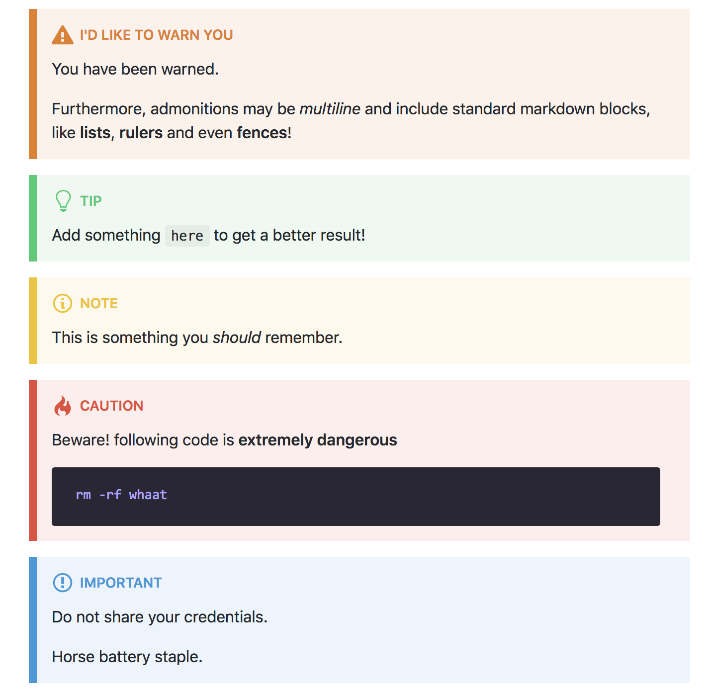

# remarkable-admonitions

[](https://travis-ci.com/favoloso/remarkable-admonitions)
[](https://codecov.io/gh/favoloso/remarkable-admonitions)
[](https://www.npmjs.com/package/remarkable-admonitions)

Adds admonitions parsing support to Remarkable



## Installation

With npm:

```sh
npm install --save remarkable-admonitions
```

or with Yarn:

```sh
yarn add remarkable-admonitions
```

## Usage

```js
import Remarkable from 'remarkable';
const md = new Remarkable();

import admonitions from 'remarkable-admonitions';
md.use(admonitions({ icon: 'emoji' }));

md.render(`
:::caution
Beware Ogre
:::
`);
/* ->
    <div class="admonition admonition-caution">
      <div class="admonition-heading">
        <h5><div class="admonition-icon">🔥</div> caution</h5>
      </div>
      <div class="admonition-content">
        <p>Beware Ogre</p>
      </div>
    </div>
*/
```

## Options

You may configure this plugin with the following options:

| Option     | Default      | Description                                                                                                                                                                            |
| ---------- | ------------ | -------------------------------------------------------------------------------------------------------------------------------------------------------------------------------------- |
| **`icon`** | `svg-inline` | Allows to use a different method to render admonition icons. By default it uses `svg-inline` with [Octicons](https://octicons.github.com) icons. Choose `emoji` to use Emojis instead. |
